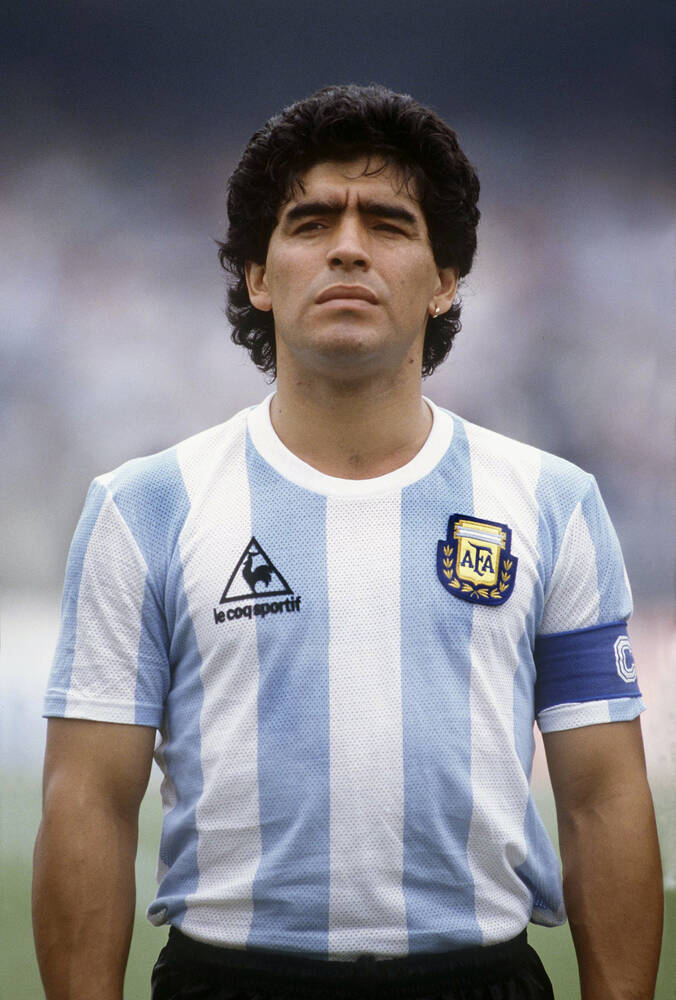
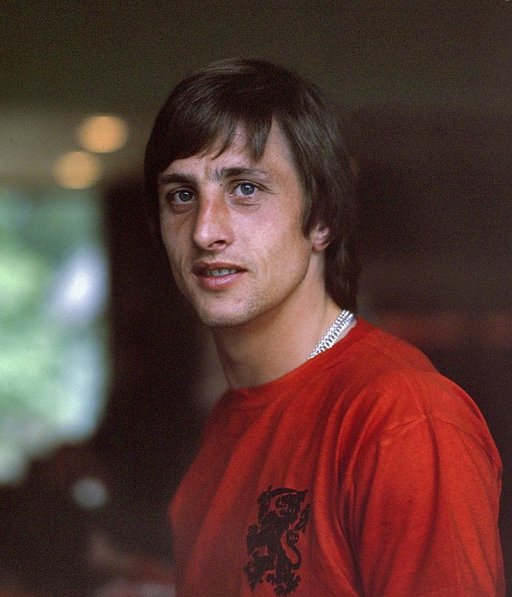
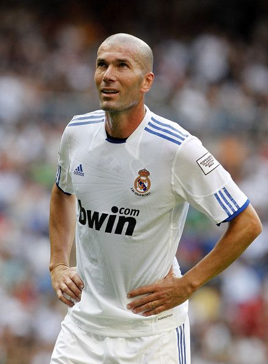

<!DOCTYPE html>
<html>
<head>
    <title>El Fútbol</title>
    
    
</head>
<body onload="greetUser()">
    

        <marquee behavior="scroll"><h1>La Historia del Fútbol</h1></marquee>
        
        

            
La historia del fútbol se considera a partir de 1869, año de fundación de la Asociación Inglesa de Fútbol, aunque en sus orígenes, 
            al igual que los demás códigos de fútbol, se remontan varios siglos en el pasado, particularmente en las islas británicas durante la Edad Media. 
            Si bien existían puntos en común entre diferentes juegos de pelota que se desarrollaron desde los años del siglo III a. C., los primeros códigos británicos 
            que dieron origen al balompié se caracterizaban por su poca organización y violencia extrema. No obstante, también existían otros códigos menos violentos 
            y mejor organizados. Quizás uno de los más conocidos fue el calcio florentino, deporte de equipo muy popular en Italia que tuvo incidencia en los códigos 
            de algunas escuelas británicas. La formación definitiva del fútbol tuvo su momento culminante durante el siglo XIX.

        

        
        
Características del fútbol

        

            <ul>
                <li><strong>Número de Jugadores:</strong> Cada equipo tiene once jugadores en el campo, incluyendo al portero.</li>
                <li><strong>Duración del Partido:</strong> Un partido de fútbol se juega en dos tiempos de 45 minutos cada uno, con un intervalo de 15 minutos entre ambos tiempos.</li>
                <li><strong>Objetivo del Juego:</strong> El objetivo principal es marcar más goles que el equipo contrario. Un gol se consigue cuando el balón cruza completamente la línea de la portería.</li>
            </ul>
        

        
        
Reglas Básicas

        

            <ul>
                <li>No se permite el uso de las manos o los brazos por parte de los jugadores, excepto por el portero dentro de su área.</li>
                <li>El fuera de juego (offside) se penaliza si un jugador está más cerca de la línea de meta contraria que el balón y el penúltimo adversario en el momento en que se le pasa el balón.</li>
                <li>Las faltas y conductas antideportivas pueden resultar en tiros libres, penales o tarjetas amarillas y rojas.</li>
            </ul>
        

        
Jugadores Históricos

        

            

                <strong>Pelé:</strong> Considerado uno de los mejores futbolistas de todos los tiempos, el brasileño Pelé ganó tres Copas del Mundo (1958, 1962, 1970) y es conocido por su habilidad, técnica y capacidad de marcar goles.
                 
                
            

            

                <strong>Diego Maradona:</strong> La leyenda argentina es famosa por su habilidad técnica y su famoso "Gol del Siglo" en el Mundial de 1986. Maradona llevó a Argentina a ganar ese torneo y es recordado por su magia con el balón.
                 
                
            

            

                <strong>Johan Cruyff:</strong> Cruyff fue un innovador del juego y un embajador del "fútbol total". El neerlandés tuvo una carrera influyente tanto como jugador como entrenador, y su legado sigue vivo en el estilo de juego del FC Barcelona.
                 
                
            

            

                <strong>Zinedine Zidane:</strong> El francés fue un maestro del centro del campo y destacó en el Mundial de 1998, donde marcó dos goles en la final. Su elegancia y visión de juego le hicieron famoso en clubes como la Juventus y el Real Madrid.
                 
                
            

            

                <strong>Cristiano Ronaldo:</strong> Conocido por su increíble capacidad física y habilidades ofensivas, Cristiano Ronaldo ha ganado múltiples Balones de Oro y ha establecido récords en la Liga de Campeones y en competiciones nacionales.
                 
                
            

        

        
Torneos Internacionales de Clubes

        

            

                <strong>Liga de Campeones de la UEFA:</strong> Es el torneo de clubes más prestigioso en Europa, organizado por la UEFA. Los mejores equipos de las ligas europeas compiten para ganar el título.  
                Próximo Evento: En curso, con la final prevista para mayo de 2025.
            

            

                <strong>Europa League:</strong> Es la segunda competición de clubes más importante en Europa, organizada por la UEFA. Los equipos que no califican para la Liga de Campeones pueden participar en esta competición.  
                Próximo Evento: En curso, con la final prevista para mayo de 2025.
            

            

                <strong>Liga de Conferencias de la UEFA:</strong> Es la tercera competición de clubes más importante en Europa, organizada por la UEFA. Se estableció para proporcionar oportunidades a clubes que no clasifican para las competiciones principales.  
                Próximo Evento: En curso, con la final prevista para mayo de 2025.
            

            

                <strong>Copa Libertadores:</strong> Es el torneo de clubes más prestigioso en América del Sur, organizado por la CONMEBOL. Los equipos compiten para ganar el título sudamericano.  
                Próximo Evento: En curso, con la final prevista para noviembre de 2024.
            

            

                <strong>Copa Sudamericana:</strong> Es el segundo torneo de clubes más importante en América del Sur, también organizado por la CONMEBOL. Se celebra cada año.  
                Próximo Evento: En curso, con la final prevista para noviembre de 2024.
            

            

                <strong>Mundial de Clubes de la FIFA:</strong> Es un torneo internacional de clubes en el que participan los campeones de cada una de las confederaciones continentales, así como el campeón de la liga anfitriona.  
                Próximo Evento: En curso, con el torneo de 2024 programado para diciembre en Arabia Saudita.
            

        

    

</body>
</html>

